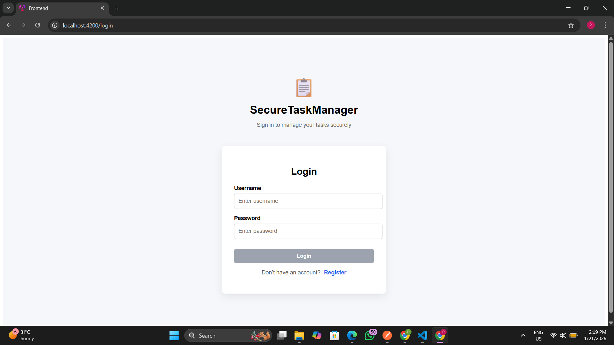
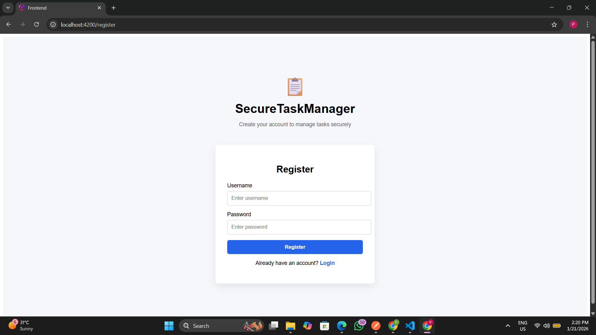
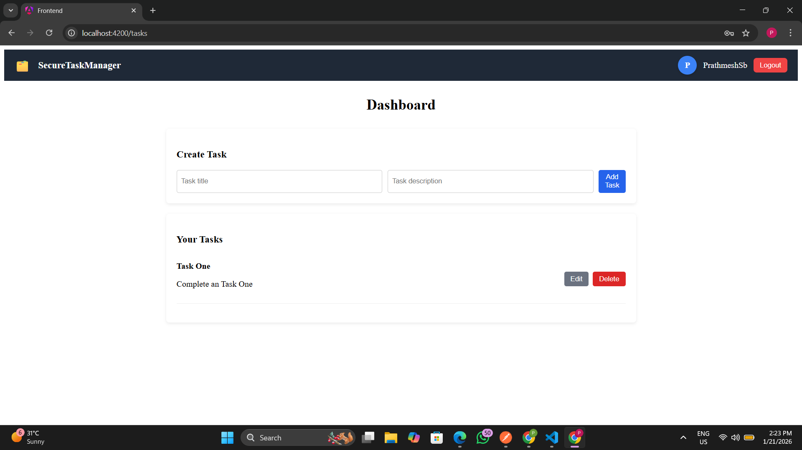
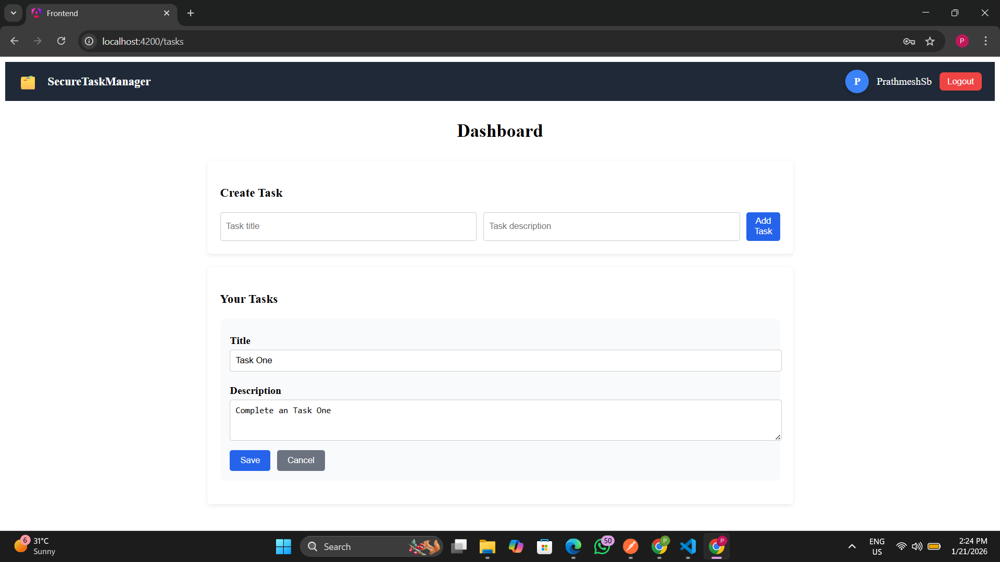

# 📋 SecureTaskManager

SecureTaskManager is a **full-stack task management web application** that allows users to securely **register, log in, and manage their personal tasks**.  
The application uses **JWT-based authentication** to protect APIs and ensures that each user can access **only their own data**.

This project was developed as part of a technical assignment to demonstrate **backend security, REST APIs, frontend state management, and clean UI design**.

---

## 🚀 Key Features

### 🔐 Authentication & Security
- User registration
- User login
- JWT token generation
- Secured APIs using Spring Security
- Authorization using HTTP interceptor (Angular)

### 📝 Task Management
- Create tasks
- View all tasks (user-specific)
- Update tasks
- Delete tasks
- Real-time UI updates without page reload

### 🎨 User Interface
- Clean and modern UI
- Navigation bar with:
  - Application logo
  - Dashboard title
  - Logged-in username
  - Profile avatar
  - Logout button
- Polished Login and Register pages
- Responsive layout

---

## 🛠️ Tech Stack

### Backend
- Java 23
- Spring Boot
- Spring Security
- JWT (JSON Web Token)
- Spring Data JPA
- H2 Database
- Maven

### Frontend
- Angular
- TypeScript
- HTML & CSS
- Angular Routing
- HTTP Interceptor
- Standalone Components

---


## 📂 Project Structure
```bash
SecureTaskManager/
│
├── frontend/ # Angular Frontend
│ ├── src/
│ └── angular.json
│
├── securetaskmanager/ # Spring Boot Backend
│ ├── src/main/java
│ ├── src/main/resources
│ └── pom.xml
│
├── screenshots/ # Project Screenshots
│
├── .gitignore
└── README.md
```

---

## 📥 Clone Project from GitHub

```bash
git clone https://github.com/prathmeshsb9/SecureTaskManager.git
cd SecureTaskManager
```
---

## ⚙️ Project Setup from Scratch (IDE Guide)

# ✅ Prerequisites

**Install the following before setup:**

- Java 17+ (Java 23 recommended)
- Node.js (v18+ recommended)
- Angular CLI
- Maven
- Git

**VS Code / IntelliJ / Eclipse**

# ▶ Backend Setup (Spring Boot)
### Step 1: Open Backend in IDE
- Open IDE (IntelliJ / Eclipse)
- Open folder: securetaskmanager

Wait for Maven dependencies to download

### Step 2: Run Backend
```bash
mvn spring-boot:run
```

Backend runs at: http://localhost:8080

H2 Database Console http://localhost:8080/h2-console


JDBC URL: jdbc:h2:mem:testdb

# ▶ Frontend Setup (Angular)

### Step 1: Open Frontend in VS Code
```bash 
cd frontend
```
### Step 2: Install Dependencies
```bash
npm install
```
### Step 3: Run Frontend
```bash
ng serve
```

Frontend runs at: http://localhost:4200
---
## 🔄 Application Flow

- User registers via Register page
- User logs in via Login page
- Backend returns a JWT token
- Token is stored in localStorage
- Angular interceptor attaches token to API requests
- Backend validates JWT for every secured request
- User performs task operations securely
- Logout clears token and redirects to login
---
## 🔐 API Endpoints

### Authentication

- **POST /api/auth/register** – Register new user
- **POST /api/auth/login** – Login & receive JWT

### Task APIs (Secured)

- **GET /api/tasks** – Get all tasks
- **POST /api/tasks** – Create task
- **PUT /api/tasks/{id}** – Update task
- **DELETE /api/tasks/{id}** – Delete task
---
## 📸 Screenshots

Screenshots are stored in the screenshots/ folder.

### 🔑 Login Page



### 📝 Register Page



### 📋 Dashboard – Task List



### ✏️ Edit Task



---
## ✅ Assignment Requirements Covered

- ✔ Secure authentication
- ✔ JWT authorization
- ✔ RESTful APIs
- ✔ CRUD operations
- ✔ Frontend state updates without reload
- ✔ Clean UI design
- ✔ GitHub version control
- ✔ Complete documentation

---

**👤 Author - Prathmesh**
--- 

## 📌 Notes

- H2 database is in-memory, data resets on restart.
- Project strictly follows assignment requirements.
- Focus is on security, correctness, and clean architecture.

## ⭐ Conclusion
- SecureTaskManager demonstrates a complete secure full-stack web application with proper authentication, authorization, backend security, and a user-friendly frontend.

